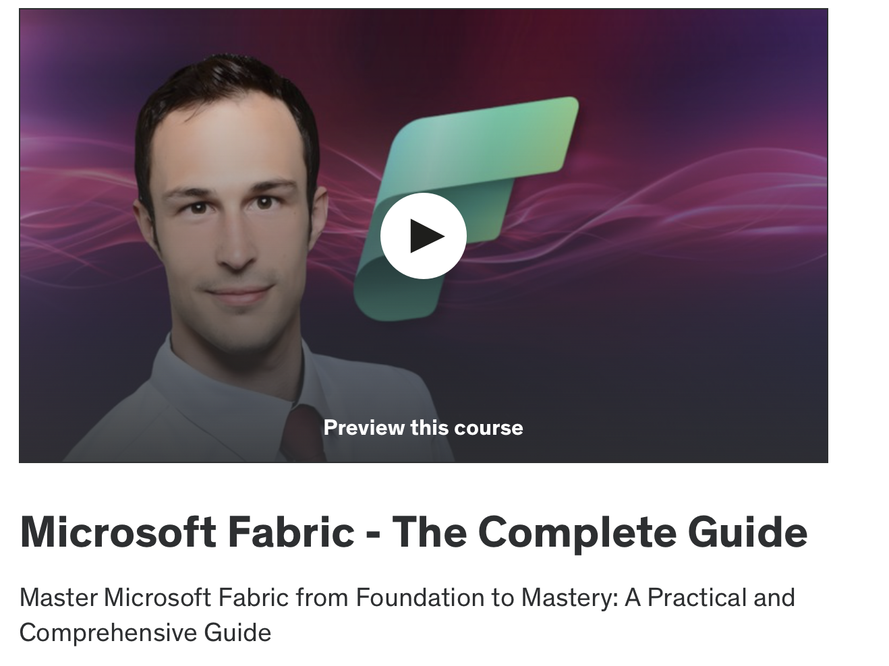

# Microsoft Fabric Study Notes

## Summary

This is my repository for the Microsoft Fabric udemy course. I will utilize a jupyter notebook for notes along with any code snippets during the workspace trial account usage.

### Video Course

Master Microsoft Fabric from Foundation to Mastery: A Practical and Comprehensive Guide

By Nikolai Schuler

### Video Description

**Mastering Microsoft Fabric: The Future of Analytics**
This is your definitive guide to master every aspect of Microsoft Fabric.

Dive deep into practical, hands-on learning to be equipped you with all you need to excel in Microsoft Fabric.

**Why This Course?**

* **Complete & Comprehensive**: This course covers every aspect of Microsoft Fabrics's expansive suite. Just one course with real and practical outcomes.
* **Real-World Scenarios**: Learn how to automate data flows, deploy and automate machine learning models, create real-time analytics pipelines and how everything is connected.
* **Conceptual Understanding**: From understanding OneLake infrastructure to unlocking the potential of the Data Activator. This course is meticulously designed to provide an extensive understanding of the Microsoft Fabric's suite.
* **Practical, Hands-On Experience**: Engage with real-world scenarios and apply what you learn directly within the Microsoft Fabric environment.

**What Will You Achieve?**
From foundational principles to advanced applications, this course equips you with all you need in Microsoft Fabric.
* **Data Engineering**: Gain expertise in data transformation and management using Microsoft Fabric's powerful data engineering tools.
* **Data Factory**: Master the use of Data Factory for efficient data integration and transformation, enabling scalable ETL processes and data pipelines.
* **Data Activator**: Learn how to utilize Data Activator to streamline the activation and availability of your data assets for analytics and decision-making.
* **Data Warehousing**: Acquire the knowledge to implement and manage robust data warehousing solutions, ensuring data is structured, stored, and ready for analysis.
* **Data Science and Machine Learning**: Build and deploy machine learning models, integrating AI into your analytics workflows.
* **Real-Time Analytics**: Tackle the fastest-growing data category with confidence, mastering the handling of observational data.
* **Power BI & Business Intelligence**: Empower decision-making with Power BI, accessing all the data in Fabric swiftly and effectively.

**Who Should Enroll?**

* Aspiring data engineers and architects seeking to lead in the analytics domain.
* Seasoned professionals aiming to specialize in Microsoft Fabric's analytics & data engineering capabilities.
* Anyone looking to gain valuable, in-demand skills in the era of AI-powered analytics.

**Enrollment Benefits:**

* **Complete Coverage**: From basics to advanced topics, we provide a structured journey through Microsoft Fabric's capabilities.
* **Real-World Applications**: Equip yourself with skills that translate directly to the workplace.
* **Lifetime Access**: Enjoy lifelong access to the course materials and updates.
* **Community and Support**: Join a community of like-minded learners and receive dedicated support to accelerate your learning journey.

**Elevate Your Career with Real Skills**

Enroll now to gain the skills that will put you at the forefront of data analytics innovation.

See you inside the course!

**What you’ll learn**
* Enhance your career with practical, hands-on Microsoft Fabric expertise.
* Architect secure, scalable solutions across the Microsoft Fabric platform.
* Navigate Microsoft Fabric's ecosystem for advanced data science applications.
* Leverage Power BI for dynamic data visualizations.
* Master real-time analytics for immediate insights from observational data.
* Develop and deploy machine learning models within Microsoft Fabric.
* Design and manage comprehensive Data Warehousing solutions for analytics.
* Utilize Data Activator for effective data asset management and analytics.
* Implement Data Factory processes for scalable ETL and data integration.
* Master Microsoft Fabric's data engineering tools for robust data solutions.

**Are there any course requirements or prerequisites?**
* No previous experience is needed. You will learn everythign you need to know
* Microsoft Fabric trial account

**Who this course is for:**
* IT Professionals that want to navigate Microsoft Fabric
* Aspiring Data Professionals eager to enter the data field with practical skills
* Data Engineers and Data Scientists looking to master Microsoft Fabric
* BI Professionals aiming to enhance skills in Fabric